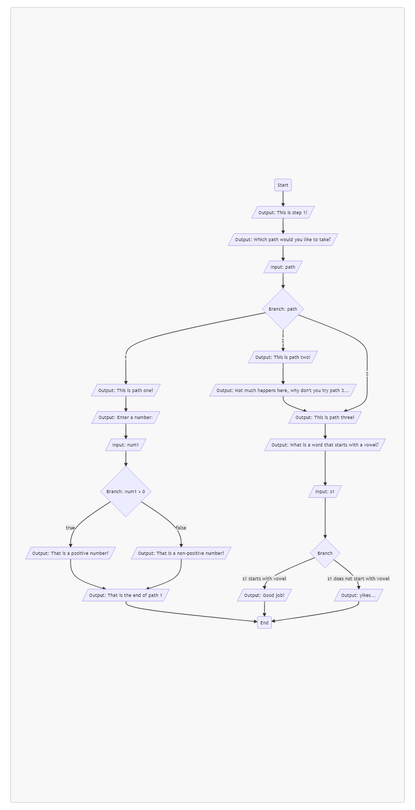

# Optional Summative Lab

## Description

You are not required to complete this lab, you may instead choose to opt out of this assignment as a whole.

I will only put this grade onto progressbook if it benefits you and increases your quarter grade.

You will have the entire week from 3/7 to 3/11 to complete this lab.

We have 120 points in the summative category at the moment, meaning that you will have 140 points if you choose to complete this lab.

This also means your total quarter grade may increase anywhere from 0% to 11.4%.

Some examples of how this may affect your grade are listed below:

| Current Summative Grade | Lab Grade | Est. Change in Quarter Grade |
| - | - | - |
| 120/120 (100%) | 20/20 (100%) | +0% |
| 108/120 (90%) | 20/20 (100%) | +1.1% |
| 96/120 (80%) | 20/20 (100%) | +2.2% |
| 84/120 (70%) | 20/20 (100%) | +3.4% |
| 72/120 (60%) | 20/20 (100%) | +4.5% |
| 60/120 (50%) | 20/20 (100%) | +5.7% |
| 0/120 (0%) | 20/20 (100%) | +11.4% |

Please consider this when making the decision to complete this lab.

## Problem Statement

The focus of this lab is to implement a working implementation of the included flowchart. You may use if-statements or switch-case statements as you feel necessary. Both can be used to complete this lab for full credit provided it matches the flowchart in all cases.

## The Flowchart



### Notation

#### Parallelogram: input or output

If one of these blocks starts with "Output", you should display the following message.

If one of these blocks starts with "Input", you should get user input and store it inside of a variable with a name matching the remainder of the block.

#### Diamond: branching logic

These make a decision based on the condition or expression listed after the word "Branch". If there is not condition or expression listed, the condition of each branch is described on the lines extending from the diamond block.

#### Rounded Rectangles: terminals

The start and end blocks have a unique shape to give you an idea of where to start and end your program.

## Input/Output

You may assume there is no input that would result in a branch that is not depicted in the flowchart.

- You should assume `path` is an integer
- You should assume `num1` is a floating point number
- You should assume `s1` is a String that may or may not contain spaces

### Sample Runs

```
This is step 1!
Which path would you like to take? 1
This is path one!
Enter a number: 100
That is a positive number!
That is the end of path 1
```

```
This is step 1!
Which path would you like to take? 2
This is path two!
Not much happens here, why don't you try path 3...
This is path three!
What is a word that starts with a vowel? Adieu
Good job!
```

```
This is step 1!
Which path would you like to take? 3
This is path three!
What is a word that starts with a vowel? word
yikes...
```

## Grading

- The first line of output matches the flowchart. (1 point)
- The second line of output matches the flowchart. (1 point)
- The variable `path` is declared to be of an appropriate type. (1 point)
- The user's input is stored inside of a variable named `path`. (1 point)
- A different message is displayed based on the value of the variable `path`. (1 point)
- When appropriate, the user is prompted for a number. (1 point)
- When appropriate, a variable `num1` is declared to be of an appropriate type. (1 point)
- When appropriate, the user's input is stored inside of the variable `num1`. (1 point)
- When appropriate, the program provides the proper output based on the value of `num1`. (1 point)
- The last line of output matches the flowchart when path 1 is chosen. (1 point)
- When path 2 is chosen, the appropriate output is displayed. (1 point)
- When appropriate, the user is prompted for a word that starts with a vowel. (1 point)
- When appropriate, a variable `s1` is declared to be of an appropriate type. (1 point)
- When appropriate, the user's input is stored inside of the variable `s1`. (1 point)
- When appropriate, the program provides the proper output based on the value of `s1`. (1 point)
- The program properly identifies when `s1` starts with a vowel, regardless of case. (1 point)
- Code style standards have been followed as discussed in class. (4 points)

## Footnotes

You should not include any extraneous output, and you should assume the output is case sensitive. Please make careful note of how the output is formatted in the sample runs, and how the output is formatted in the flowchart.
